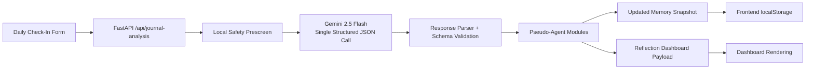

# Breathe

Breathe is an AI-powered wellness companion for students preparing for high-pressure exams such as JEE, NEET, UPSC, CAT, GATE, and CUET.

This repository is intentionally scoped as a hackathon-ready but production-styled monorepo. The current implementation focuses on one polished vertical slice:

`Daily Check-In -> backend orchestration -> Gemini structured analysis -> multi-agent processing -> Reflection Dashboard`

## Overview

Breathe is designed to help students:

- journal daily
- track emotional well-being
- detect stress and burnout signals
- notice hidden emotional patterns over time
- receive contextual emotional support
- maintain reflection continuity without creating dependency

The architecture favors modularity, safety, and evaluator readability over heavy infrastructure. There is no database, no auth layer, no WebSocket layer, and no orchestration framework such as LangChain or CrewAI.

## Tech Stack

- Frontend: React, Vite, TypeScript, Tailwind CSS
- Backend: FastAPI, Pydantic, httpx
- AI Integration: Gemini 2.5 Flash through a single structured backend call
- Deployment: Single Docker container, Google Cloud Run compatible
- Testing: pytest

## Multi-Agent Architecture

The app simulates a production-grade multi-agent system with lightweight service modules.

### Core Backend Structure

```text
backend/
|-- api/
|   |-- routes/
|-- core/
|-- middleware/
|-- schemas/
|-- services/
|   |-- agents/
|   |   |-- intent_agent.py
|   |   |-- emotion_agent.py
|   |   |-- memory_agent.py
|   |   |-- milestone_agent.py
|   |   |-- longitudinal_agent.py
|   |   |-- safety_agent.py
|   |   |-- recommendation_agent.py
|   |   `-- conversation_agent.py
|   |-- ai/
|   |   |-- gemini_client.py
|   |   |-- prompt_builder.py
|   |   `-- response_parser.py
|   `-- orchestration/
|       `-- orchestrator.py
|-- tests/
`-- main.py
```

### Orchestration Flow

The backend uses one Gemini structured response, then distributes the result into modular pseudo-agents:

1. Safety Agent
2. Intent Agent
3. Emotion Agent
4. Memory Agent
5. Milestone Agent
6. Longitudinal Agent
7. Recommendation Agent
8. Conversation Agent

### Flow Diagram



## Structured AI Contract

Gemini is asked to return a strict JSON object with the following top-level shape:

```json
{
  "safety_assessment": {},
  "intent_analysis": {},
  "emotional_analysis": {},
  "memory_updates": {},
  "milestone_events": [],
  "longitudinal_patterns": [],
  "recommendations": {},
  "conversation_response": {}
}
```

The backend validates this response with Pydantic before any UI payload is returned.

## Safety Architecture

Safety is intentionally layered:

- A local prescreen runs before any model call to detect severe crisis indicators.
- Gemini also returns a structured safety assessment as part of the single orchestration response.
- The Safety Agent enforces safe support mode when distress is elevated.
- Safe support mode softens recommendations, avoids diagnostic language, and encourages trusted human support.
- The system avoids manipulative emotional attachment and does not roleplay as therapy.

## Memory Strategy

Breathe uses lightweight long-term memory without a database.

- Backend: memory is processed as structured Pydantic objects
- Frontend: memory is persisted in `localStorage`
- Memory fields include `active_exams`, `primary_stressor_exam`, study phase, stress triggers, motivation sources, recurring patterns, coping preferences, milestone history, and emotional trends
- The Memory Agent deduplicates and compacts updates so the stored context stays useful and small

## Frontend Slice

The implemented frontend flow includes:

- chip-based multi-exam onboarding
- journal textarea
- mood slider
- energy slider
- stress slider
- loading and error states
- accessible form structure
- local memory persistence
- dashboard rendering for emotional analysis, triggers, burnout risk, milestones, recommendations, and encouragement

## Environment Setup

Create a local `.env` file based on `.env.example`.

Important variables:

- `AI_PROVIDER=gemini`
- `AI_MODEL=gemini-2.5-flash`
- `AI_API_KEY` or `GEMINI_API_KEY`
- `GEMINI_TIMEOUT_SECONDS`
- `CORS_ORIGINS`
- `VITE_API_BASE_URL`

## Local Development

### Backend

Install backend dependencies from [`backend/requirements.txt`](/D:/Softwares/breathe/backend/requirements.txt) and run:

```bash
uvicorn backend.main:app --reload --host 0.0.0.0 --port 8000
```

### Frontend

Install frontend dependencies inside [`frontend/`](/D:/Softwares/breathe/frontend) and run:

```bash
npm install
npm run dev
```

## Testing

Lightweight tests cover:

- health endpoint
- orchestrator response validation
- schema parsing
- milestone parsing
- safety fallback logic
- journal analysis API payload shape

Run:

```bash
pytest backend/tests
```

## Deployment

The Dockerfile builds the React app and copies the static bundle into the FastAPI backend so one container serves both API routes and frontend assets.

Cloud Run readiness:

- container listens on `PORT`
- static frontend serving remains inside FastAPI
- no background workers are required
- environment variables control model access and CORS

## Security and Accessibility Notes

Security practices:

- no hardcoded secrets
- backend-only AI calls
- restricted CORS configuration
- structured validation on all orchestration payloads
- graceful fallback when Gemini is unavailable or times out

Accessibility practices:

- semantic layout landmarks
- keyboard-accessible navigation
- labeled form controls
- responsive layout
- calmer high-contrast text on warm neutral surfaces

## Current Scope

This is still intentionally a focused hackathon slice. The repo now has a thoughtfully engineered orchestration foundation, but it does not yet include full product flows, persistence beyond localStorage, or broader weekly/timeline intelligence.
