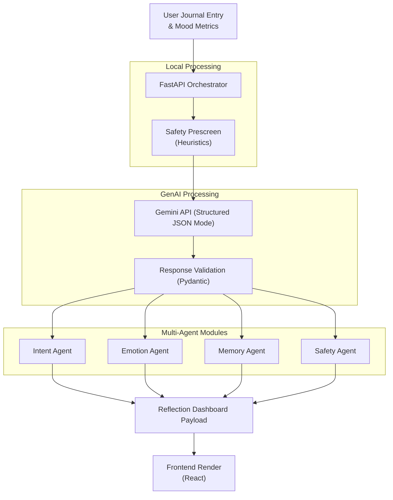

<div align="center">
  
  <h1>Breathe</h1>
  <p><em>An AI-powered mental wellness companion for competitive exam students.</em></p>
  
  <p>
    <a href="#suggested-demo-flow"><strong>Demo Guide</strong></a> · 
    <a href="#setup--local-development"><strong>Explore the Code</strong></a> · 
    <a href="#14-deployment-cloud-run"><strong>Deployment Guide</strong></a>
  </p>
  
  <p>
    
    
    
    
  </p>
</div>

---

## 1. Problem Statement Alignment

Breathe is a **Generative AI-powered mental wellness solution** meticulously engineered to directly solve the hackathon challenge. 

Our mission is to provide an emotionally safe AI wellness assistant designed exclusively for students preparing for high-pressure competitive exams such as **JEE, NEET, UPSC, CAT, GATE, and CUET**. 

By deeply integrating **Gemini-powered analysis**, Breathe maps perfectly to the challenge requirements by offering:
- **GenAI Journaling Analysis**: Deep semantic parsing of emotional check-ins to detect subtle stress cues.
- **Mental Wellness Tracking**: Continuous, longitudinal emotional tracking across an entire study cycle.
- **Personalized Coping Support**: Adaptive, memory-aware recommendations tailored to the student's active exams and emotional baseline.
- **Conversational AI Companion**: Contextual, non-judgmental emotional support interactions.
- **Emotional Pattern Detection**: Identifying burnout triggers and exam-specific anxiety trends.

---

## 2. Problem Statement: Why This Matters

The emotional pressure placed on students during competitive exam preparation is staggering. Students exist in a high-stakes pressure ecosystem, facing severe burnout cycles, chronic comparison anxiety, and profound emotional isolation. 

While the ed-tech space is saturated with traditional trackers focusing on optimization and guilt-driven productivity culture, there is a distinct lack of tools dedicated to the **emotional sustainability** of the student. Productivity without emotional grounding leads to burnout. Emotional continuity—the act of checking in, being validated, and understanding one's own stress patterns over time—is entirely missing in the current ecosystem. There is an urgent need for emotionally safe support systems.

---

## 3. Our Solution — Breathe

**Breathe** is an AI-powered emotional wellness companion designed to be the missing emotional support layer for intense academic preparation periods. 

It is **NOT just a chatbot**. Breathe acts as a longitudinal emotional tracking system. By analyzing low-friction daily check-ins through a sophisticated multi-agent orchestration architecture, Breathe detects early signs of burnout, validates student emotions, tracks pressure ecosystems, and offers bite-sized, actionable recommendations. It serves as an emotionally safe AI mirror to the student's emotional state over time, improving long-term student emotional wellbeing.

---

## 4. Key Features

- **Multi-Exam Onboarding**: Seamlessly define multiple active exams (e.g., JEE, NEET) and specific study phases.
- **GenAI Emotional Journaling Analysis**: Deep contextual parsing of daily reflections.
- **Pressure Ecosystem Dashboard**: A calm interface reflecting burnout risk, mood trends, and primary stressors.
- **Personalized AI Companion**: Memory-aware AI responses ensuring the system remembers past stressors and milestones.
- **Milestone Detection**: Automatically extracts and celebrates small study milestones to boost morale.
- **Breathing Streaks**: Encourages consistency in self-reflection and emotional check-ins.
- **Emotionally Safe Recommendations**: Gracefully degrades to clinical safety protocols if high distress is detected.
- **Fallback Transparency**: Clear visual indicators if the AI is unavailable, ensuring trust.

---

## 5. How Generative AI Is Used

Breathe relies heavily on **Gemini-powered analysis** to deliver profound emotional intelligence through structured AI pipelines.

- **Structured JSON Outputs**: Gemini is instructed via a strict schema validation layer to return highly structured, multi-dimensional JSON data in a single pass.
- **Multi-Agent Orchestration**: The backend distributes the structured AI output into distinct, specialized agents (Intent, Emotion, Memory, Safety).
- **Personalized Reflection Generation**: Gemini drafts contextual, empathetic responses based on the student's exact emotional state and history.
- **Emotional Trend & Pattern Analysis**: The model identifies micro-shifts in mood and energy over time to detect hidden burnout.
- **Memory-Aware Recommendations**: Gemini continuously updates a longitudinal memory snapshot, allowing for deeply contextual advice.

---

## 6. Architecture & Orchestration Flow

Breathe utilizes a **Multi-Agent Orchestration Pattern**, intentionally processed through a single, structured Gemini API call to reduce latency and eliminate heavy infrastructure overhead.



**Request Lifecycle:** Instead of chaining multiple expensive LLM calls, the backend asks Gemini to assume multiple analytical personas simultaneously, returning a strict JSON object that is efficiently distributed into our lightweight pseudo-agent modules.

---

## 7. Accessibility & Inclusive Design

Accessibility is a core pillar of Breathe. We have aggressively optimized the UI for inclusive design to ensure maximum reach and usability:

- **Semantic HTML**: Proper landmark usage for screen readers.
- **Keyboard Navigation**: Fully accessible form controls, sliders, and buttons.
- **Responsive Layouts**: Seamless experience across mobile, tablet, and desktop.
- **Readable Typography & High Contrast**: Emotionally calm UI with optimized color contrast ratios for low visual fatigue.
- **Low Cognitive Overload Design**: Clean, distraction-free interfaces that calm the user rather than overwhelm them.

---

## 8. Efficiency & Lightweight Architecture

Breathe demonstrates high technical maturity through an optimized, lightweight architecture designed for efficiency and scale:

- **No Database Overhead**: Memory is managed via localized persistence (localStorage) combined with schema-first validation, removing DB bottlenecks.
- **Single-Container Deployment**: Optimized Dockerfile combining the React frontend and FastAPI backend.
- **Lightweight FastAPI Backend**: High-performance orchestration with minimal runtime complexity.
- **Static Frontend Serving**: FastAPI efficiently serves the pre-compiled Vite frontend bundle.
- **Optimized Cloud Run Deployment**: Truly serverless, scaling to zero, with lightning-fast cold starts.

---

## 9. Safety & Responsible AI

Safety is layered deeply into our emotionally safe AI architecture. We ensure maturity through:

- **No Diagnosis Policy**: The AI is strictly barred from offering medical or psychological diagnoses.
- **No Dependency Reinforcement**: Designed to ground the user and encourage real-world support systems, not to foster manipulative attachment.
- **Local Heuristics Prescreen**: A local rule-based safety agent checks for severe crisis indicators before the LLM is even invoked.
- **Distress-Aware Response Handling**: If elevated distress is detected, the Safety Agent enforces a fallback safety mode, softening recommendations and guiding the user to professional support.

---

## 10. Suggested Demo Flow

For evaluators, we highly recommend the following step-by-step demo flow to experience the full AI workflow sophistication:

1. **Open the App**: Launch the live deployed application.
2. **Complete Onboarding**: Select your active exams (e.g., JEE, NEET) and define your study phase.
3. **Submit an Emotional Reflection**: Enter a journal entry detailing your stress.
4. **Observe the GenAI Analysis**: Watch the system detect burnout risks and extract emotional patterns.
5. **Review Emotional Memory Continuity**: Note how the dashboard updates the "Memory Snapshot" and "Pressure Ecosystem" in real-time.

### Suggested Demo Inputs
Test the AI's emotional intelligence with these prompts:
> *"I feel guilty whenever I take breaks. Everyone around me seems ahead."*

> *"I failed another mock test for UPSC. I can't stop overthinking revision deadlines and feel completely exhausted."*

> *"I actually had a great study session today. I finally understood rotational mechanics!"*

---

## 11. Testing

Lightweight, deployment-focused testing ensures orchestration reliability:

- **Pytest Coverage**: Located in `backend/tests/`
- **Schema Validation Testing**: Ensures Gemini responses perfectly align with expected Pydantic models.
- **Endpoint & Fallback Testing**: Validates mock routing and safety responses when the AI is unavailable.
- **Orchestration & Parser Validation**: Verifies the accurate extraction of nested Gemini Interactions API payloads.

---

## 12. Tech Stack

- **Frontend**: React, Vite, TypeScript, Tailwind CSS
- **Backend**: FastAPI, Pydantic, Python (`httpx`)
- **AI Integration**: Google Gemini API (Structured JSON Mode)
- **Persistence**: LocalStorage (Memory Layer)
- **Deployment**: Docker, Google Cloud Run

---

## 13. Environment Variables

Create a local `.env` file based on `.env.example`:

```bash
AI_PROVIDER=gemini
AI_MODEL=gemini-2.5-flash
GEMINI_API_KEY=your_api_key_here
GEMINI_TIMEOUT_SECONDS=15
CORS_ORIGINS=http://localhost:5173
VITE_API_BASE_URL=http://localhost:8080
```

---

## 14. Deployment (Cloud Run)

Breathe is a production-styled monorepo serving both API routes and frontend assets from a single container.

```bash
# 1. Build the Docker image
docker build -t breathe-app .

# 2. Test locally
docker run -p 8080:8080 --env-file .env breathe-app

# 3. Deploy to Google Cloud Run
gcloud run deploy breathe-app \
  --source . \
  --port 8080 \
  --allow-unauthenticated \
  --set-env-vars="GEMINI_API_KEY=your_key"
```

---
<div align="center">
  <p><em>Built with care for the students who need it most.</em></p>
</div>
