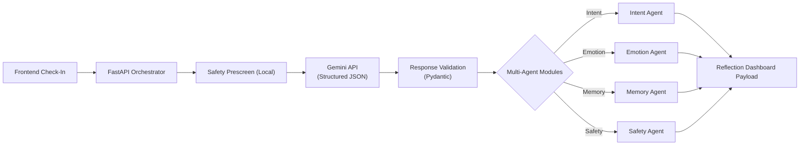

<div align="center">
  
  <h1>Breathe</h1>
  <p><em>An emotionally intelligent wellness companion for high-pressure students.</em></p>
  
  <p>
    <a href="#setup--local-development"><strong>Explore the Code</strong></a> · 
    <a href="#11-deployment-cloud-run"><strong>Deployment Guide</strong></a>
  </p>
  
  <p>
    
    
    
    
  </p>
</div>

---

## 2. Problem Statement

The emotional pressure placed on students during competitive exams (JEE, NEET, UPSC, CAT, etc.) is staggering. Students face severe burnout, chronic comparison anxiety, and profound emotional isolation. 

While the ed-tech space is saturated with traditional trackers focusing on optimization, productivity, and syllabus completion, there is a distinct lack of tools dedicated to the **emotional sustainability** of the student. Productivity without emotional grounding leads to burnout. Emotional continuity—the act of checking in, being validated, and understanding one's own stress patterns over time—is often lost in the race to the finish line.

## 3. Our Solution — Breathe

**Breathe** is an AI-powered emotional wellness companion designed specifically for intense academic preparation periods. 

It is **NOT just a chatbot**. Breathe acts as a longitudinal emotional support layer. By analyzing low-friction daily check-ins through a sophisticated multi-agent orchestration architecture, Breathe detects early signs of burnout, validates student emotions, tracks pressure ecosystems, and offers bite-sized, actionable recommendations. It serves as a mirror to the student's emotional state over time, providing context-aware, emotionally safe interactions.

## 4. Key Features

- **Multi-Exam Onboarding**: Seamlessly define multiple active exams and specific study phases.
- **Pressure Ecosystem Dashboard**: A calm interface that reflects burnout risk, mood trends, and primary stressors.
- **Emotional Pattern Analysis**: Actively detects linguistic and physiological markers to surface hidden burnout.
- **Memory-Aware AI Responses**: Longitudinal memory ensures the companion remembers past stressors, exams, and milestones.
- **Milestone Detection**: Automatically extracts and celebrates small study milestones to boost morale.
- **Breathing Streaks**: Encourages consistency in self-reflection and emotional check-ins.
- **Emotionally Safe Recommendations**: Gracefully degrades to clinical safety protocols if high distress is detected.
- **Structured AI Orchestration**: Multi-layered JSON response validation powered by Gemini.
- **Fallback Transparency**: Clear visual indicators if the AI is unavailable, ensuring trust.
- **Cloud Run Deployment Readiness**: Fully containerized production-style architecture serving both API and frontend.

## 5. Architecture & Multi-Agent Orchestration

Breathe utilizes a **Multi-Agent Orchestration Pattern**, intentionally processed through a single, structured Gemini API call to reduce latency and eliminate heavy infrastructure like LangChain.



**The Orchestration Flow:** Instead of chaining multiple expensive LLM calls, the backend uses a single comprehensive prompt. The orchestrator asks Gemini to assume multiple analytical personas simultaneously, returning a strict JSON object that is distributed into our lightweight pseudo-agent modules.

## 6. Structured AI Contract

Gemini is instructed to return a strict JSON object with the following top-level shape, rigorously validated by Pydantic before hitting the frontend:

```json
{
  "safety_assessment": {},
  "intent_analysis": {},
  "emotional_analysis": {},
  "memory_updates": {},
  "milestone_events": [],
  "longitudinal_patterns": [],
  "recommendations": {},
  "conversation_response": {}
}
```

## 7. Safety & Responsible AI

Safety is not an afterthought; it is layered deeply into the architecture:

- **Local Heuristics Prescreen**: Before any LLM call, a local rule-based safety agent checks for severe crisis indicators.
- **Structured AI Safety Assessment**: Gemini returns a dedicated safety assessment metric as part of its core payload.
- **Safe Support Mode**: If elevated distress is detected, the Safety Agent enforces a safe support mode. This softens recommendations, avoids diagnostic language, and clearly guides the student toward trusted human support systems.
- **Anti-Dependency**: The platform is explicitly designed to act as a supportive mirror, not to manipulate emotional attachment or roleplay as a therapist.

## 8. Memory Strategy

Breathe utilizes lightweight, scalable long-term memory without requiring a database for this hackathon slice:

- **Backend**: Memory context is processed, deduplicated, and compacted into structured Pydantic objects by the Memory Agent.
- **Frontend**: Memory is persistently stored in `localStorage`, maintaining fields like `active_exams`, `primary_stressor_exam`, stress triggers, coping preferences, and emotional trends.

## 9. Tech Stack

- **Frontend**: React, Vite, TypeScript, Tailwind CSS
- **Backend**: FastAPI, Pydantic, Python (`httpx`)
- **AI Integration**: Google Gemini API (Structured JSON Mode)
- **Persistence**: LocalStorage (Memory Layer)
- **Deployment**: Docker, Google Cloud Run

## 10. Environment Variables

Create a local `.env` file based on `.env.example` in the root directory:

```bash
AI_PROVIDER=gemini
AI_MODEL=gemini-2.5-flash  # Or gemini-1.5-pro / gemini-1.5-flash
GEMINI_API_KEY=your_api_key_here
GEMINI_TIMEOUT_SECONDS=15
CORS_ORIGINS=http://localhost:5173
VITE_API_BASE_URL=http://localhost:8080
```
> [!NOTE]
> Breathe gracefully falls back to a transparent local mock if `GEMINI_API_KEY` is omitted, preventing startup crashes.

## 11. Deployment (Cloud Run)

Breathe is a production-styled monorepo. The Dockerfile builds the React app and copies the static bundle into the FastAPI backend so one single container serves both API routes and frontend assets.

```bash
# 1. Build the Docker image
docker build -t breathe-app .

# 2. Test locally
docker run -p 8080:8080 --env-file .env breathe-app

# 3. Deploy to Google Cloud Run
gcloud run deploy breathe-app \
  --source . \
  --port 8080 \
  --allow-unauthenticated \
  --set-env-vars="GEMINI_API_KEY=your_key"
```

## 12. API Endpoints

The backend exposes several key orchestration routes:

- `GET /api/health`: Validates system and model readiness.
- `GET /api/debug/gemini-test`: Lightweight diagnostic route to test Gemini connectivity and response parsing.
- `POST /api/journal-analysis`: The core orchestration endpoint. Accepts the daily journal and memory snapshot, triggering the multi-agent pipeline.
- *Onboarding Endpoints*: Dedicated routes for initial profile construction.

## 13. Testing

Lightweight, deployment-focused tests verify the orchestration flow:

- **Pytest Coverage**: Located in `backend/tests/`
- **Schema Validation**: Tests ensure Gemini responses perfectly align with expected Pydantic models.
- **Endpoint Tests**: Validates fallback behaviors, health checks, and mock routing.
- **Run Tests**: `pytest backend/tests`

## 14. Future Improvements

While Breathe is currently a polished, highly functional vertical slice for this hackathon, future iterations will implement:

- **Persistent Database**: Encrypted cloud persistence for secure, private long-term memory storage.
- **Longitudinal Analytics**: Automated weekly insight reports graphing emotional trends over months.
- **Secure Authentication**: Multi-device synchronization.
- **Therapist Escalation Systems**: Opt-in bridges to school counselors or professional therapy platforms.
- **Multilingual Support**: Providing emotional validation in the student's native language.

---
<div align="center">
  <p><em>Built with care for the students who need it most.</em></p>
</div>
